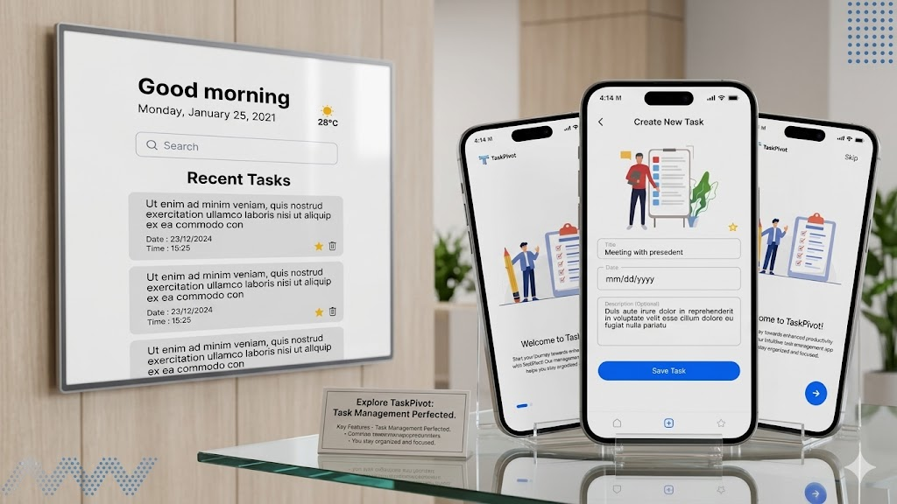

# Task Manager App 📝

A simple and user-friendly **Task Manager** application built with **Flutter** that helps users organize and manage their daily tasks efficiently.

## ✨ Features

* Add new tasks.
* View a list of tasks.
* Edit existing tasks.
* Delete tasks.
* Mark tasks as completed or incomplete.
* Store tasks locally using **SharedPreferences**.
* Simple and intuitive user interface.

## 🛠️ Technologies Used

* **Flutter**
* **Dart**
* **SharedPreferences** for local data storage.

## 📂 Project Structure

```text
lib/
├── main.dart
├── screens/
│   └── home_screen.dart
├── models/
│   └── task_model.dart
├── widgets/
│   └── task_item.dart
└── services/
    └── shared_preferences_service.dart
```

## 📦 Dependencies

```yaml
dependencies:
  flutter:
    sdk: flutter
  shared_preferences: ^2.2.2
```

## 🚀 Getting Started

1. Clone the repository:

```bash
git clone https://github.com/your-username/task-manager-app.git
```

2. Navigate to the project directory:

```bash
cd task-manager-app
```

3. Install dependencies:

```bash
flutter pub get
```

4. Run the application:

```bash
flutter run
```

## 💾 Local Storage

This application uses **SharedPreferences** to store task data locally on the device, allowing users to keep their tasks saved even after closing and reopening the app.

## 🎯 Project Objectives

This project was created to practice:

* Building mobile applications with Flutter.
* Working with local storage using SharedPreferences.
* Implementing basic CRUD operations (Create, Read, Update, Delete).
* Organizing a Flutter project using a clean structure.

## 👨‍💻 Developer

Developed by **Alaa**.

---

⭐ If you like this project, feel free to give it a Star on GitHub.
